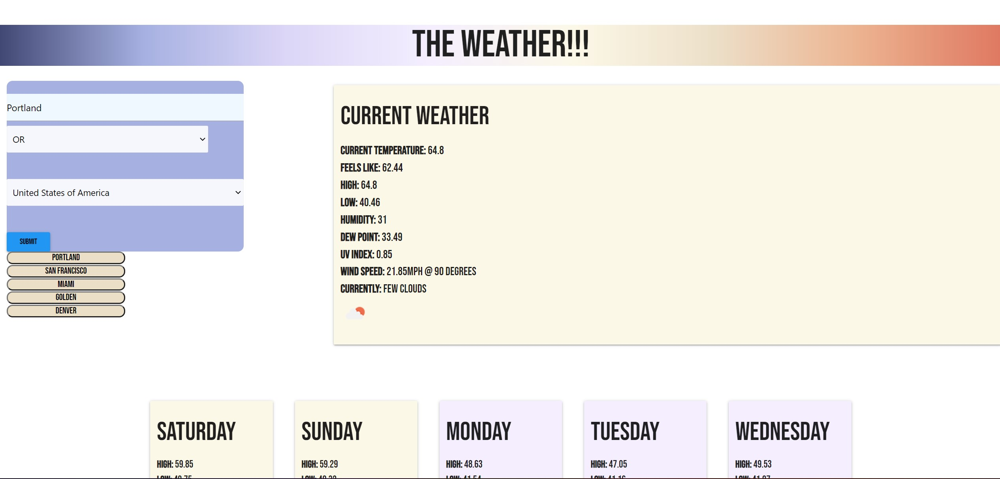

# weather-app
Weather forecast in various cities

The user enters the city and country (and state if in the US) and the current weather is pulled up along with a 7 day forecast. 

App upon first load

Recent History is saved to the right. These are clickable links to the weather

The forecast colors will change based on the temperatures for the day

## Future development: 
- formatting and styling
- adding an option for metric)

app is deployed at: https://agarraffa.github.io/weather-app/